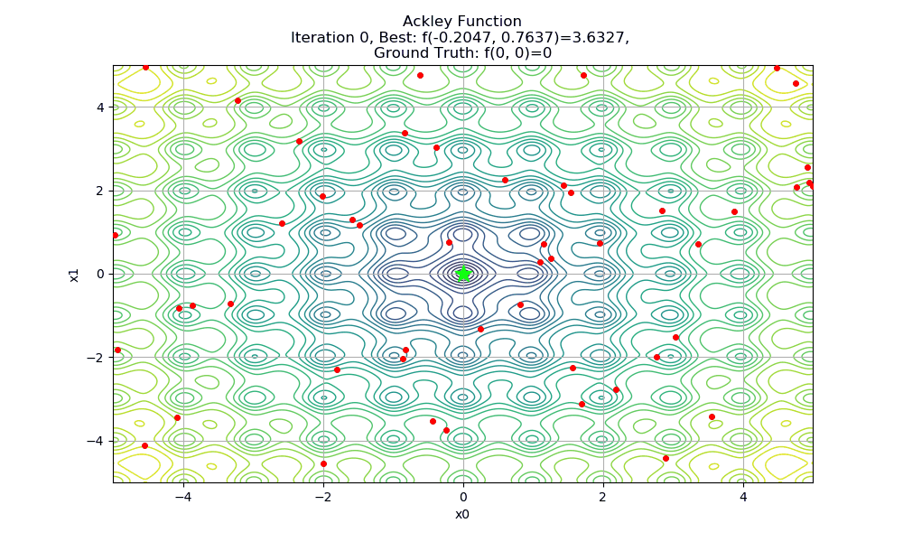
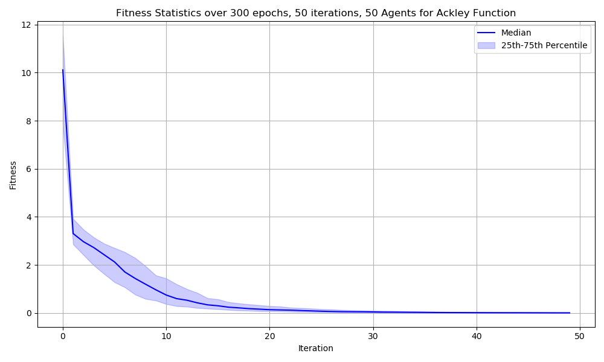
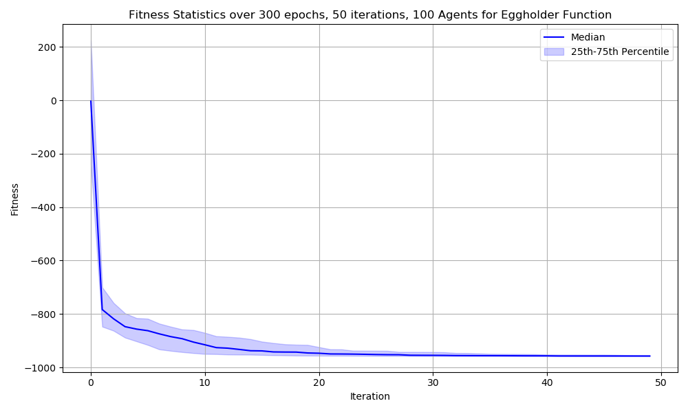

# SpyOpt

`SpyOpt` is a C++ implementation of the metaheuristic spy_algorithm [1]. It can search for global optimal solutions for arbitrary non-convex functions.

(Japanese)
`SpyOpt` はメタヒューリスティクスである `spy_algorithm` [1] の C++ 実装です。
任意の非凸関数に対し、大域最適解を探索することができます。

## Demo

**Ackley Function**

<p float="left">
  
  
</p>

**Eggholder Function**

<p float="left">
    
    
</p>

## Requirement

- A compiler that supports C++17
- `yaml-cpp` library

## Installation

1. **Install yaml-cpp:**

    On Ubuntu:
    ```bash
    sudo apt update
    sudo apt install libyaml-cpp-dev

1. **Clone the repository:**

   ```bash
   git clone git@github.com:KentaKato/SpyOpt.git
   cd SpyOpt
   ```

2. **Create a build directory:**

   ```bash
   mkdir build
   cd build
   ```

3. **Run CMake and build:**

   ```bash
   cmake ..
   make
   ```

This will produce the executable file `spyopt` in the `build` directory.

## Usage

1. **Execute Optimization**

    After building, you can run the spyopt executable:

    ```bash
    ./spyopt
    ```

    The results will be saved in `results/agents_history.yaml` and `results/best_solution_history.csv`.

2. **Animation of History of Agents' Motion**

    ```bash
    cd SpyOpt
    python3 scripts/agents_motion_gif.py
    ```

    The gif file will be saved in current directory.

## Configuration

**How to Modify Search Parameters**

Settings can be adjusted via `resources/config.yaml`.

```yaml
num_agents:    50  # Number of agents. Should be greater than (num_high_rank + num_mid_rank)
num_high_rank: 10  # Number of high rank agents
num_mid_rank:  25  # Number of mid rank agents
num_iterations: 50 # Number of iterations
swing_factor: 1
objective_function: Ackley # Booth, Eggholder, Ackley
```

**How to Customize the Objective Function**

1. Implement it as following:

    ```cpp
    double your_custom_function(const std::vector<double> &pos)
    {
        ...
        return ...;
    }
    ```

2. Set the search space in `resources/config.yaml`.

    ```yaml
    lower_bounds: [-5., -5.]
    upper_bounds: [5., 5.]
    ```

3. Pass the custom function as an argument to the `SpyOpt`` constructor and execute the `optimize()` method.

    Minimum Code Example:
    ```cpp
    #include <iostream>
    #include "SpyOpt/spy_opt.h"
    #include "SpyOpt/config_parser.h"
    #include "SpyOpt/objective_functions.h" // Assuming you've added your custom function in this header

    int main() {
        // Define a simple custom objective function
        auto custom_function = [](const std::vector<double> &pos) -> double
        {
            return pos[0] * pos[0] + pos[1] * pos[1];
        };

        Config config;
        if (!parseConfig("resources/config.yaml", config))
        {
            std::cerr << "[Error] Failed to parse config!" << std::endl;
            return -1;
        }

        SpyOpt spy_alg(config, custom_function);
        spy_alg.optimize();

        const auto [fitness, pos] = spy_alg.getBestFitness();
        std::cout << "Best solution:" << std::endl;
        spy_alg.printBestAgent();
        spy_alg.dumpAgentsHistory("../results/agents_history.csv");
        spy_alg.dumpBestSolutionHistory("../results/best_solution_history.csv");

        return 0;
    }
    ```

## Reference

[1] Pambudi, Dhidhi, and Masaki Kawamura. "Novel metaheuristic: spy algorithm." IEICE TRANSACTIONS on Information and Systems 105.2 (2022): 309-319.